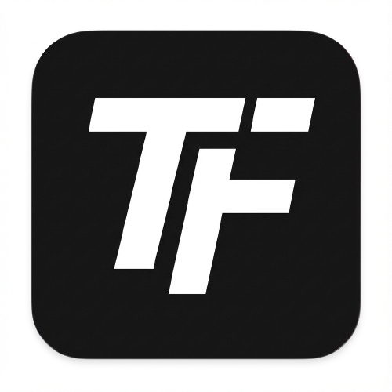

# TurboFrame

<p align="center">
  
</p>

<p align="center">
  <strong>⚡ The Lightweight PHP Framework for Students & Developers ⚡</strong>
</p>

<p align="center">
  TurboFrame is a next-generation PHP framework engineered for <b>speed</b>, <b>simplicity</b>, and <b>beginner-friendly</b> experience. Built to make coding fun again.
</p>

---

## � Quick Installation

Get started in seconds using Composer:

```bash
composer create-project turbo/lambostarter my-app
cd my-app
php lambo serve
```

Your app is now running at `http://localhost:7000`

---

## ✨ Key Features

- **🏎️ Lambo CLI**: Simple commands to serve, make controllers, and clear cache.
- **🔥 Nitrous Mode**: Extreme performance by compiling your app into a single file.
- **📱 PWA Ready**: Turn your website into a mobile app out-of-the-box.
- **🎨 Modern Engine**: Clean template syntax and powerful Query Builder.
- **🎓 Student Friendly**: Minimalist code that is easy to read and learn.

---

## 📚 Official Documentation

For full documentation, tutorials, and deep-dive syntax, please visit our official site:

### 👉 [turboframe.my.id/docs](https://turboframe.my.id/docs)

---

## 🛠️ Basic Usage

### Routing
```php
// routes/site.php
$router->get('/', function() {
    return view('welcome');
});
```

### Controller
```php
public function index() {
    return view('home', ['name' => 'TurboFrame']);
}
```

---

## 📄 License

TurboFrame is open-sourced software licensed under the [GNU GPL license](LICENSE.txt).

<p align="center">
  Made with ⚡ by <b>Rizko Imsar</b> & TurboFrame Community
</p>
